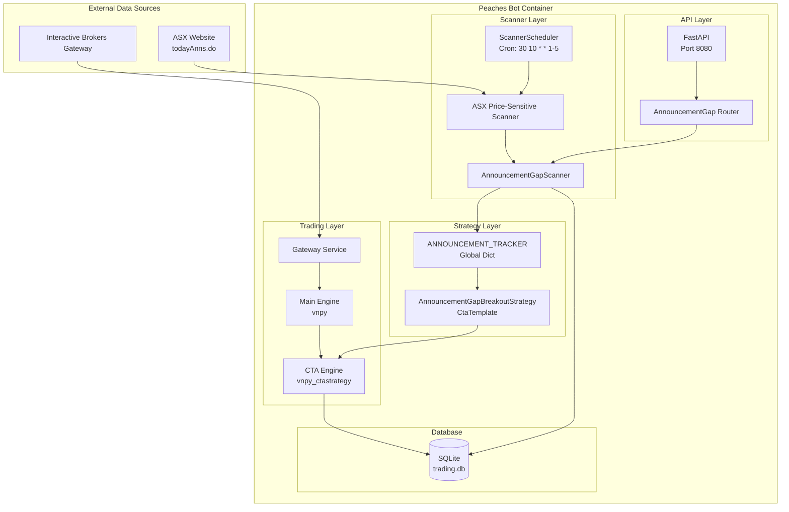
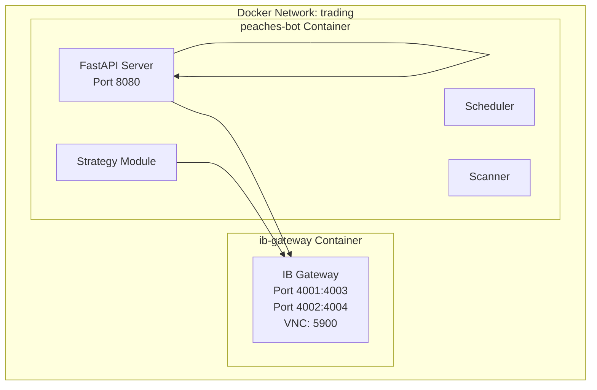
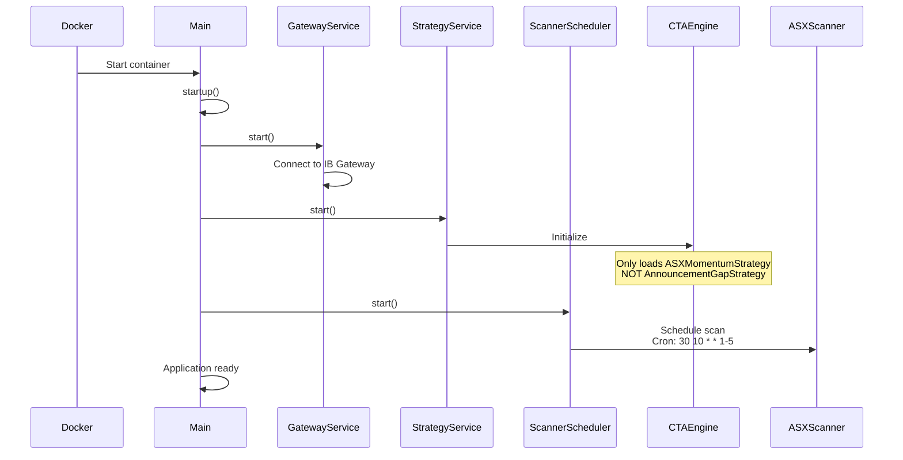
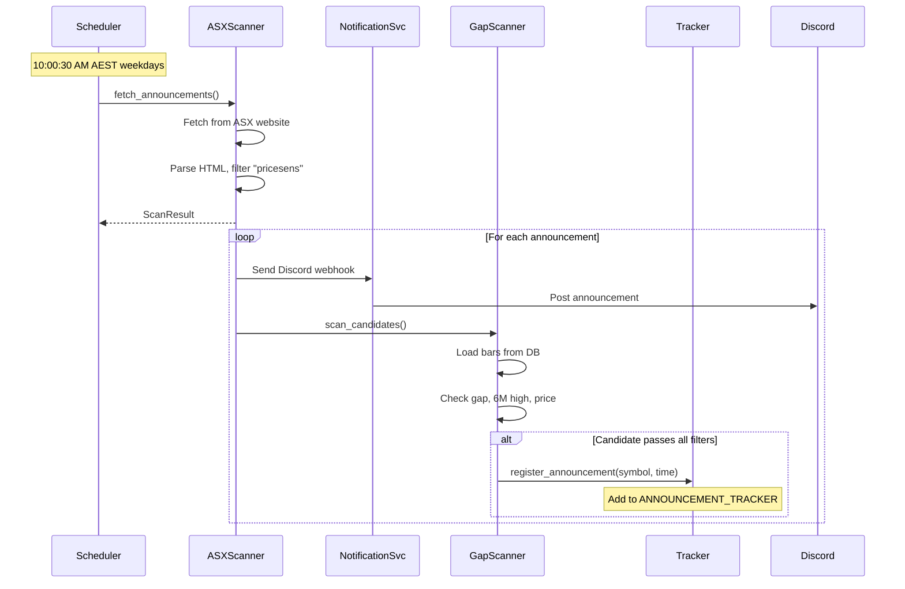
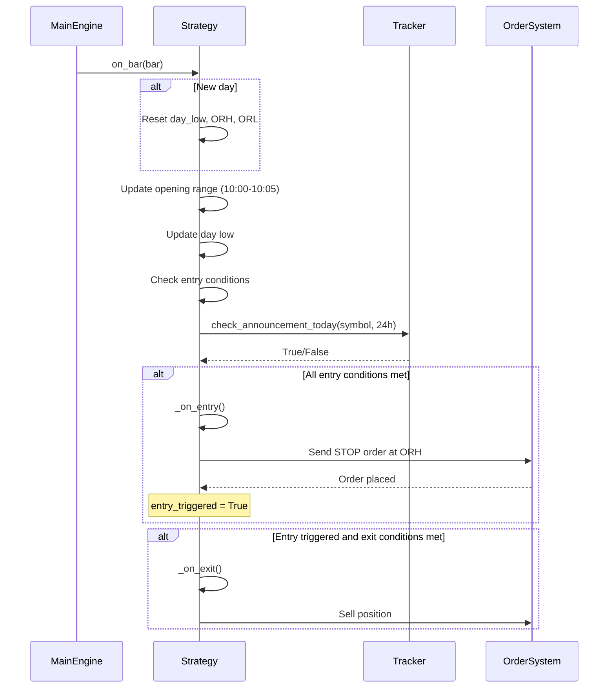
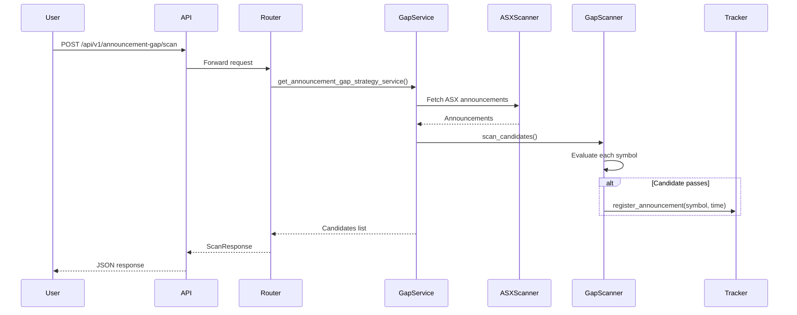
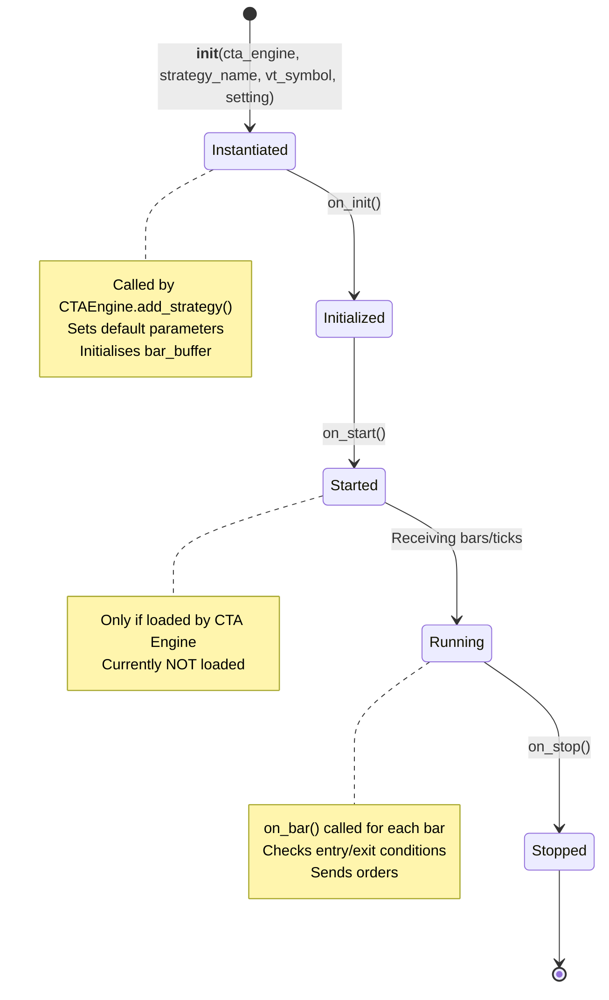
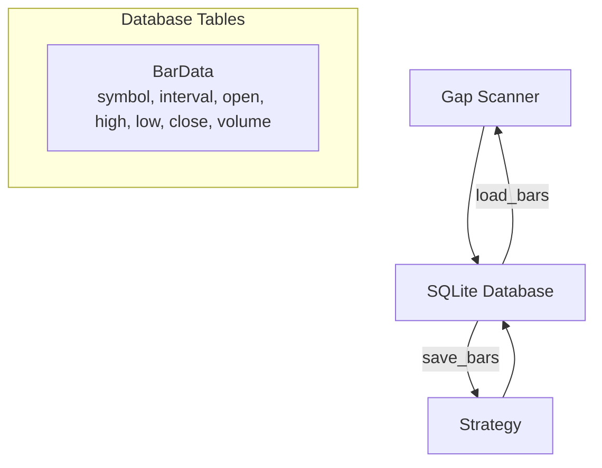

# Announcement Gap Breakout Strategy Documentation

## Executive Summary

The **Announcement Gap Breakout Strategy** is an ASX-focused momentum strategy that capitalises on price gaps following price-sensitive announcements. The strategy identifies stocks that have made announcements, gapped up positively, and broken through their 6-month high, entering after a 5-minute opening range breakout.

**Status**: Strategy code exists but is NOT currently loaded in the CTA engine. It operates in scan-only mode via announcement tracking.

---

## Strategy Overview

### Core Logic

```python
# Entry Conditions (all must be true):
1. Stock made a price-sensitive announcement today (within 24 hours)
2. Positive gap from previous close (gap_pct >= min_gap_pct)
3. Current price > 6-month high
4. Stock price >= min_price ($0.20 default)
5. Time >= 10:05 AM AEST (5-minute opening range set)

# Execution:
- Place market stop order at opening range high (ORH)
- Stop loss set to day low
- Position size: 100 shares (default)

# Exit Conditions:
- Time-based exit after 3 days
- No take profit target
```

### Strategy Parameters

| Parameter | Default | Description |
|-----------|---------|-------------|
| `min_price` | 0.20 | Minimum stock price threshold |
| `min_gap_pct` | 0.0 | Minimum gap percentage (0 = any positive gap) |
| `lookback_months` | 6 | Lookback period for high calculation |
| `opening_range_minutes` | 5 | Opening range duration (minutes) |
| `position_size` | 100 | Number of shares per trade |
| `max_positions` | 10 | Maximum concurrent positions |
| `exit_days` | 3 | Days to hold before exit |

---

## System Architecture

### High-Level Architecture



### Docker Infrastructure



**Docker Services** (docker-compose.yml):

| Service | Image | Ports | Health Check |
|---------|-------|-------|--------------|
| `ib-gateway` | ghcr.io/gnzsnz/ib-gateway:stable | 4001, 4002, 5900 | TCP to 4004 |
| `peaches-bot` | Built from Dockerfile | 8080 | HTTP to /api/v1/health |

**Volumes**:
- `./config:/app/config:ro` - Configuration
- `./app/strategies:/app/strategies:ro` - Strategy code (read-only)
- `/opt/peaches/data:/app/data` - Data storage (historical, trading)
- `./logs:/app/logs` - Logs

---

## Process Flow

### Startup Sequence



### Daily Scan Flow (Announcement Registration)



### Trading Signal Flow (If Strategy Was Loaded)



### API Trigger Flow (Manual Scan)



---

## Entry Points and Initialization

### Code Entry Points

| Entry Point | File | Purpose |
|-------------|------|---------|
| `main:app` | `app/main.py` | FastAPI application (uvicorn entry) |
| `AnnouncementGapBreakoutStrategy` | `app/strategies/announcement_gap_strategy.py:66` | Strategy class |
| `register_announcement()` | `app/strategies/announcement_gap_strategy.py:25` | Global registration function |
| `check_announcement_today()` | `app/strategies/announcement_gap_strategy.py:36` | Check for recent announcement |
| `run_scan()` | `app/scheduler/scanner_scheduler.py:84` | Scheduled scan job |
| `scan_candidates()` | `app/scanner/announcement_gap_scanner.py:68` | Candidate scanner |

### Strategy Class Lifecycle



### Current Strategy Loading Status

**File**: `app/services/strategy_service.py:31-36`

```python
cta_engine.add_strategy(
    "ASXMomentumStrategy",  # Only this strategy is loaded
    STRATEGY_NAME,
    VT_SYMBOL,
    DEFAULT_PARAMETERS,
)
```

**Result**: `AnnouncementGapBreakoutStrategy` is NOT loaded into the CTA engine. It cannot actively trade.

---

## Configuration

### Settings (config/settings.yaml)

```yaml
scanner:
  gap-threshold: 3.0        # Not used by strategy
  min-price: 1.0            # Not used by strategy
  min-volume: 100000        # Not used by strategy
  opening-range-time: "10:05"
  enable-scanner: false     # API scanner disabled

scanners:
  enabled: true
  asx:
    scan-schedule: "30 10 * * 1-5"  # 10:00:30 AM AEST weekdays
    url: "https://www.asx.com.au/asx/v2/statistics/todayAnns.do"
    timeout: 10
  triggers:
    enabled: true
    strategies:
      - "asx_momentum"      # Only triggers ASXMomentumStrategy
```

### Strategy Default Parameters

**File**: `app/strategies/announcement_gap_strategy.py:55-63`

```python
DEFAULT_PARAMETERS = {
    "min_price": 0.20,
    "min_gap_pct": 0.0,
    "lookback_months": 6,
    "opening_range_minutes": 5,
    "position_size": 100,
    "max_positions": 10,
    "exit_days": 3,
}
```

---

## Data Flow

### Announcement Tracking

```mermaid
graph LR
    A[ASX Scanner] --> B[Gap Scanner]
    B -->|Candidate passes filters| C[register_announcement]
    C --> D[ANNOUNCEMENT_TRACKER<br/>dict[symbol, datetime]]
    D --> E[Strategy checks entry]
    E --> F[check_announcement_today]
    F -->|symbol in tracker & < 24h| G[Return True]
```

**Tracker Structure**:
```python
ANNOUNCEMENT_TRACKER: dict[str, datetime] = {
    "BHP": datetime(2026, 1, 22, 10, 0, 30),
    "CBA": datetime(2026, 1, 22, 9, 45, 0),
}
```

### Database Access



---

## API Endpoints

### Announcement Gap Strategy API

**Base Path**: `/api/v1/announcement-gap`

| Method | Endpoint | Description |
|--------|----------|-------------|
| POST | `/scan` | Scan for announcement gap candidates |
| POST | `/sample-opening-ranges` | Scan and sample opening ranges |

#### POST /api/v1/announcement-gap/scan

**Request**:
```json
{
  "min_price": 0.20,
  "min_gap_pct": 0.0,
  "lookback_months": 6
}
```

**Response**:
```json
{
  "success": true,
  "candidates_count": 2,
  "candidates": [
    {
      "symbol": "BHP",
      "gap_pct": 2.5,
      "six_month_high": 48.50,
      "current_price": 49.75,
      "announcement_headline": "Quarterly Report",
      "announcement_time": "2026-01-22T10:00:30",
      "exchange": "LOCAL"
    }
  ],
  "message": "Found 2 candidates"
}
```

### Scanner Control API

| Method | Endpoint | Description |
|--------|----------|-------------|
| POST | `/api/v1/scanners/trigger` | Manual trigger for ASX scan |
| GET | `/api/v1/scanners/status` | Scanner status |

---

## Important Questions and Answers

### Q: Will this strategy just work now?

**A: NO.** Here's why:

1. **Not loaded in CTA Engine**: `strategy_service.py` only loads `ASXMomentumStrategy`. The announcement gap strategy is never initialised or started.

2. **No real-time market data**: The strategy requires live bar data (`on_bar()` callbacks). While the IB Gateway is running, the strategy isn't subscribed to receive data.

3. **Missing strategy instance**: `AnnouncementGapBreakoutStrategy` must be added to the CTA engine with a `vt_symbol` (e.g., "BHP-STK-ASX").

4. **No multi-symbol support**: The current implementation is single-symbol. To scan multiple symbols, you'd need one strategy instance per symbol.

### Q: What parts are currently working?

**A: Only the scanning/candidate identification part**:

- ASX announcement scanner runs daily at 10:00:30 AM AEST
- `AnnouncementGapScanner` evaluates candidates against filters
- `register_announcement()` populates `ANNOUNCEMENT_TRACKER`
- API endpoints work for manual scanning

### Q: How to make it trade actively?

**A: Required changes**:

1. **Load strategy into CTA Engine** (`app/services/strategy_service.py`):
   ```python
   cta_engine.add_strategy(
       "AnnouncementGapBreakoutStrategy",
       "announcement_gap",
       "BHP-STK-ASX",  # Add per symbol
       DEFAULT_PARAMETERS,
   )
   ```

2. **Multi-symbol support**:
   - Create strategy instances for each candidate
   - Dynamically add strategies based on scan results

3. **Market data subscription**:
   - Ensure CTA engine subscribes to bars for each symbol
   - Verify IB Gateway provides real-time data

4. **Enable trading**:
   - Set IB Gateway to live mode (currently paper trading)
   - Ensure account has sufficient funds

### Q: How does it fit with Docker infrastructure?

**A: Integration points**:

| Component | Status |
|-----------|--------|
| IB Gateway | Running, connected to peaches-bot |
| CTA Engine | Running (only ASXMomentumStrategy) |
| Scanner Scheduler | Running, scans ASX at 10:00:30 AM |
| Announcement Tracker | Working, in-memory dict |
| API Endpoints | Available, scanner disabled by default |

### Q: What are the dependencies?

**A: External and internal dependencies**:

**External**:
- ASX website (todayAnns.do) for announcements
- IB Gateway for market data and order execution
- SQLite database for historical bar data

**Internal**:
- vnpy framework (CtaTemplate, CtaEngine)
- Loguru for logging
- BeautifulSoup for HTML parsing

### Q: What are the limitations?

**A: Known limitations**:

1. **In-memory tracker**: `ANNOUNCEMENT_TRACKER` is lost on restart. No persistence.

2. **Single-instance design**: Strategy designed for one symbol. Not production-ready for multi-symbol scanning.

3. **No position sizing logic**: Fixed 100 shares, ignores account balance.

4. **No risk management**: No max drawdown, daily loss limits, or position correlation checks.

5. **Timezone assumptions**: Hard-coded AEST (Australia/Sydney). May not work in other regions.

6. **Opening range calculation**: Assumes 10:00 AM market open. ASX opens at 10:00 AM AEST.

### Q: How to test the strategy?

**A: Testing approaches**:

1. **Manual scan via API**:
   ```bash
   curl -X POST http://localhost:8080/api/v1/announcement-gap/scan \
     -H "Content-Type: application/json" \
     -d '{"min_price": 0.20, "min_gap_pct": 0.0, "lookback_months": 6}'
   ```

2. **Backtesting**: Use peaches-analysis CLI (if available)

3. **Paper trading**: Set IB Gateway to paper mode and load strategy

4. **Check logs**:
   ```bash
   docker logs peaches-bot
   ```

### Q: How is the announcement tracker populated?

**A: Two paths**:

1. **Scheduled scan** (automatic):
   - ScannerScheduler runs at 10:00:30 AM
   - ASXPriceSensitiveScanner fetches announcements
   - AnnouncementGapScanner filters candidates
   - Calls `register_announcement()` for each candidate

2. **Manual API call**:
   - POST to `/api/v1/announcement-gap/scan`
   - Same flow as scheduled scan

### Q: What happens when the strategy checks for announcements?

**A: Check logic** (`check_announcement_today()`):

```python
def check_announcement_today(symbol: str, lookback_hours: int = 24) -> bool:
    if symbol not in ANNOUNCEMENT_TRACKER:
        return False

    announcement_time = ANNOUNCEMENT_TRACKER[symbol]
    cutoff = datetime.now() - timedelta(hours=lookback_hours)

    return announcement_time >= cutoff
```

- Returns `True` if symbol in tracker AND announcement < 24 hours ago
- Returns `False` otherwise

---

## Key Files Reference

| File | Purpose |
|------|---------|
| `app/strategies/announcement_gap_strategy.py` | Strategy implementation |
| `app/scanner/announcement_gap_scanner.py` | Candidate scanner |
| `app/scanners/asx_price_sensitive.py` | ASX announcement fetcher |
| `app/scheduler/scanner_scheduler.py` | Scheduled scan job |
| `app/services/strategy_service.py` | CTA engine (strategy loading) |
| `app/api/v1/announcement_gap/router.py` | API endpoints |
| `docker-compose.yml` | Docker infrastructure |
| `config/settings.yaml` | Configuration |

---

## Summary

The Announcement Gap Breakout Strategy is a well-designed momentum strategy with complete logic for scanning, filtering, and trading. However, it is **not currently trading**:

- **Working parts**: ASX scanner, candidate filtering, announcement tracking, API endpoints
- **Missing parts**: Strategy loading into CTA engine, market data subscription, multi-symbol support
- **To enable**: Load strategy instance per symbol, subscribe to market data, ensure IB Gateway in live mode

The strategy is production-ready from a code quality standpoint but requires integration work to become an active trading system.
